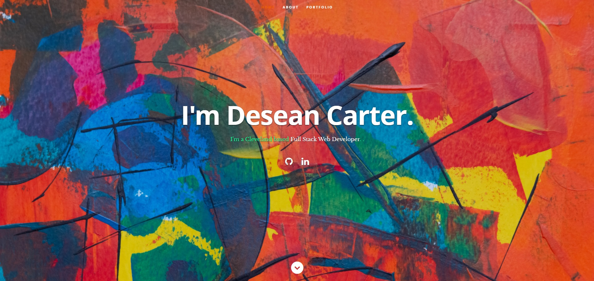

# React-Portfolio
A portfolio using a React framework to render a responsive website on various devices and screens. This example incluse a personal bio of myself that will be updated as my career expands. Semantic HTML elements were added to help the user experience and to improve SEO. Thanks for your feedback!

Deployed site:[Portfolio](https://deseancarter.github.io/React-Portfolio/)

Public working respository:(https://github.com/DeseanCarter/React-Portfolio)

